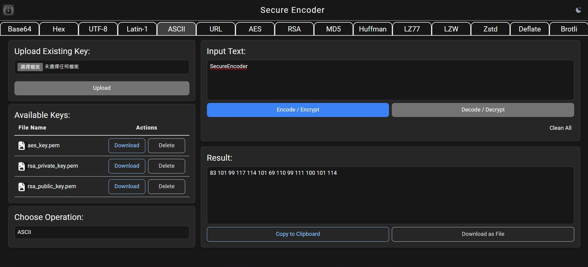

# Secure Encoder




## Project Statistics

[![Stargazers][stars-shield]][stars-url]
[![Forks][forks-shield]][forks-url]
[![Follow][follow-shield]][follow-url]
[![LinkedIn][linkedin-shield]][linkedin-url]

[![Issues][issues-shield]][issues-url]
[![Pull Requests][pulls-shield]][pulls-url]
[![Contributors][contributors-shield]][contributors-url]
[![MIT License][license-shield]][license-url]


## Continuous Integration Status
[![CircleCI][circleci-shield]][circleci-url]
[](https://codecov.io/gh/clchinkc/SecureEncoder)


## Supported Languages


## Introduction
**Secure Encoder** is a web application designed for encoding and decoding text using various cryptographic algorithms. It supports operations such as Base64, Hex, UTF-8, Latin-1, ASCII, and URL encoding/decoding, alongside encryption and decryption using AES and RSA algorithms. The primary goal is to offer a user-friendly interface for secure text manipulation, making it particularly useful for developers and security professionals.

This project addresses the need for reliable and secure methods of data manipulation in web applications. It simplifies the process for developers who require quick encoding and decoding solutions and provides robust encryption tools for security professionals to ensure data safety.

The application is built using Python Flask, React, and SQLAlchemy, leveraging Vite and Tailwind CSS for the front end.

## Features
- [x] **File Uploads:** Users can upload key files needed for encryption/decoding.
- [x] **Dynamic Encoding/Decoding:** Support for multiple encoding schemes including Base64, Hex, and more.
- [x] **Encryption and Decryption:** Implements AES and RSA algorithms with key management for secure data handling.
- [x] **Interactive UI:** The React-based interactive UI ensures a smooth user experience.
- [x] **Security:** Implements best practices like Content Security Policy headers.

## Tech Stack

<div align="center">

| Component      | Technology Used            | Description                               |
|----------------|----------------------------|-------------------------------------------|
| Frontend       | React.js, TypeScript       | Interactive UI built with React           |
| Backend        | Flask (Python)             | Server-side logic handled by Flask        |
| CSS Framework  | Tailwind                   | Styling provided by Tailwind CSS          |
| Database       | sqlalchemy                 | ORM for database interactions (if used)   |
| CI/CD          | CircleCI                   | Continuous integration and deployment     |
| Containerization | Docker, Docker Compose (optional)   | Container setup for development and production environments |

</div>

## Project Setup

### Prerequisites
- [Node.js](https://nodejs.org/en/) (v14 or later)
- [npm (Node Package Manager)](https://www.npmjs.com/)
- [Python](https://www.python.org/downloads/) (3.8 or later)

### Environment Setup
1. Clone the repository:
   ```bash
   git clone git@github.com:clchinkc/SecureEncoder.git
   ```

2. Set environment variables:
   Update the `.env` file in the SecureEncoderReact directory or the src file inside SecureEncoderFlask directory if necessary.

### Running the Application in Separate Terminals

#### Backend
1. Navigate to the `SecureEncoderFlask` directory.
   ```bash
   cd SecureEncoderFlask
   ```

2. Set up the backend for the first time running:
   ```bash
   pip install -r requirements.txt
   ```

3. Run the Flask application:
   ```bash
   python run.py
   ```
   This will launch the backend on `http://localhost:5000`.

#### Frontend
1. Open a new terminal and navigate to the `SecureEncoderReact` directory.
   ```bash
   cd SecureEncoderReact
   ```

2. Set up the frontend for the first time running:
   ```bash
   npm install
   ```

3. Start the React application:
   ```bash
   npm run dev
   ```
   Build and start the built application:
   ```bash
   npm run build
   npm run serve
   ```
   Or to run the production build on local static server:
   ```bash
   npx serve -s build
   ```
   
   This will launch the web application on `http://localhost:3000` and connect it to the Flask backend.

# React Frontend with Docker Compose

>This project sets up a React frontend application using Docker and Docker Compose for development with hot reloading.

## Prerequisites

- [Docker](https://www.docker.com/products/docker-desktop)
- [Docker Compose](https://docs.docker.com/compose/install/)

## Getting Started

>Follow these instructions to get the React frontend application up and running in a Docker container.

### Step 1: Build and Run the Container

Use Docker Compose to build and start the container:

```bash
docker-compose up --build
```

### Step 2: Accessing the Application

Open your browser and navigate to:

```bash
http://localhost:3000
```

### Stopping the Container

Open your browser and navigate to:

```bash
docker-compose down
```


## Notes
- Keep your cryptographic keys secure and ensure they are not exposed to unauthorized users.
- Regularly update dependencies to mitigate vulnerabilities associated with outdated libraries.


#


<!-- links -->
[your-project-path]: clchinkc/SecureEncoder
[follow-shield]: https://img.shields.io/github/followers/clchinkc.svg?style=flat-square
[follow-url]: https://github.com/clchinkc
[contributors-shield]: https://img.shields.io/github/contributors/clchinkc/SecureEncoder.svg?style=flat-square
[contributors-url]: https://github.com/clchinkc/SecureEncoder/graphs/contributors
[forks-shield]: https://img.shields.io/github/forks/clchinkc/SecureEncoder.svg?style=flat-square
[forks-url]: https://github.com/clchinkc/SecureEncoder/network/members
[stars-shield]: https://img.shields.io/github/stars/clchinkc/SecureEncoder.svg?style=flat-square
[stars-url]: https://github.com/clchinkc/SecureEncoder/stargazers
[issues-shield]: https://img.shields.io/github/issues/clchinkc/SecureEncoder.svg?style=flat-square
[issues-url]: https://img.shields.io/github/issues/clchinkc/SecureEncoder.svg
[pulls-shield]: https://img.shields.io/github/issues-pr/clchinkc/SecureEncoder
[pulls-url]: https://img.shields.io/github/issues-pr/clchinkc/SecureEncoder
[license-shield]: https://img.shields.io/github/license/clchinkc/SecureEncoder.svg?style=flat-square
[license-url]: https://github.com/clchinkc/SecureEncoder/blob/master/LICENSE.txt
[circleci-shield]: https://dl.circleci.com/status-badge/img/circleci/WNz31DEf8bF44pHHr3dwni/N8K1spakYUa4DvNqX3q44k/tree/main.svg?style=svg
[circleci-url]: https://dl.circleci.com/status-badge/redirect/circleci/WNz31DEf8bF44pHHr3dwni/N8K1spakYUa4DvNqX3q44k/tree/main
[linkedin-shield]: https://img.shields.io/badge/-LinkedIn-black.svg?style=flat-square&logo=linkedin&colorB=555
[linkedin-url]: https://linkedin.com/in/clchinkc
